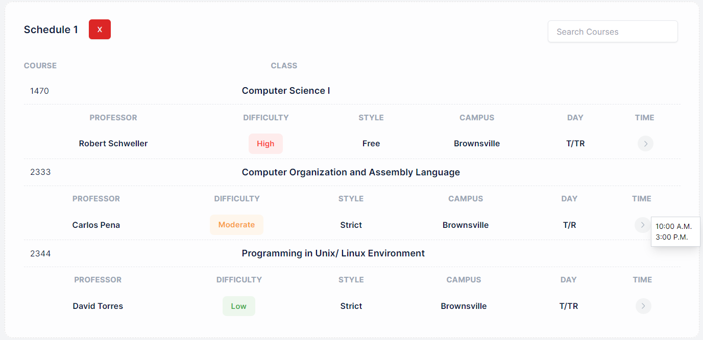

# Vaquero Scheduler

## Introduction

Vaquero Scheduler is a dynamic, user-friendly course scheduling platform built with Next.js 13 and TypeScript. Tailwind is used as the styling framework. Prisma is used as middleware to manage relational database operations using the PostgreSQL language. Vercel is used to deploy the project.

Designed to simplify the process of creating academic schedules, it offers robust features tailored to meet the specific needs of students. By considering various parameters like campus location, time of day, professor difficulty, and teaching style, it generates personalized course schedules.

## Features

- **Account Creation**: Users can sign up to create personalized accounts.
- **Schedule Generation**: Generate custom course schedules based on user-specific parameters like campus location, time slots, professor difficulty ratings, and teaching styles.
- **User/Student Information**: A dedicated page for users to view and manage their personal information.
- **Authenticated Access**: Integration with Next Auth for secure, unique user experiences.
- **Personalized Schedule Viewing**: Users can view their generated schedules, uniquely tailored to their academic needs.
- **Degree Catalogs**: Access to degree catalogs showcasing courses included in specific academic programs.

## Getting Started

### Prerequisites

- A package manager like npm or Yarn

### Installation

1. Clone the repository:
   ```bash
   git clone https://github.com/dvvin/vaquero-scheduler.git
   ```

2. Navigate to the project directory:
   ```bash
   npm install
   npm run dev
   Open http://localhost:3000 with your browser to use the app.
   ```
### Example Usage:

